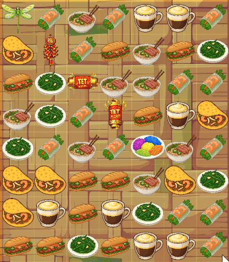
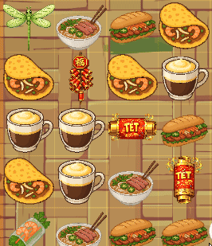

# Pho Logic

  
  
<b>Vietnamese-inspired Match-3 puzzle game crafted with Flutter and Flame.</b>

  <a href="https://cuongme.itch.io/ph-logic">Play Demo</a> •
  <a href="https://cuongme.github.io/pho_logic_mvp/documentation.html">Technical Documentation</a> •
  <a href="https://cuongme.github.io/pho_logic_mvp/">Privacy Policy</a>

## About The Game
Pho Logic is a colorful puzzle experience inspired by Vietnamese cuisine, festive street culture, and the satisfying rhythm of modern Match-3 design. Every stage is built to feel fast, readable, and rewarding, from the first tile swap to the last cascade. Instead of relying on visual noise, the game emphasizes clear board states, expressive effects, and a playful identity rooted in Vietnamese food icons and seasonal celebration energy.

At its core, the game is designed around flow. A turn begins with a simple swap, then quickly expands into chain reactions, special interactions, and board-wide momentum shifts. Power abilities are made to feel impactful without overwhelming the player, so strategy remains understandable while still producing dramatic moments. This balance between clarity and spectacle is the central design goal of the project.

Pho Logic is also a technical prototype for scalable content production. Layout and positioning are driven through JSON design files so screen composition remains consistent across different device sizes. This allows artwork, world elements, and gameplay UI to stay visually aligned while the game adapts responsively. The architecture is intentionally modular, separating board logic, rendering, audio, and inventory systems so the project can evolve into a larger production-ready title.

## Gameplay Showcase

| Blocker | Dragon Fly |
| --- | --- |
|  |  |

| Firecracker | Sticky Rice Bomb |
| --- | --- |
|  |  |

## Project Description
Pho Logic is built with Flutter (Dart) and the Flame engine, combining app-level flexibility with focused 2D gameplay performance. The project structure separates gameplay systems, reusable UI components, and data-driven layout definitions so each part can be improved without destabilizing the rest of the game. This repository contains the complete source, assets, JSON design files, and web documentation site for the MVP.

The current version is `1.0.0+6`, and the project remains an actively refined prototype centered on gameplay feel, visual consistency, and cross-platform reliability.

## License
Licensed under the MPL2.0 License. See `LICENSE`. If you build on top of this please give credits to this source git, it would be much appreciated. 
